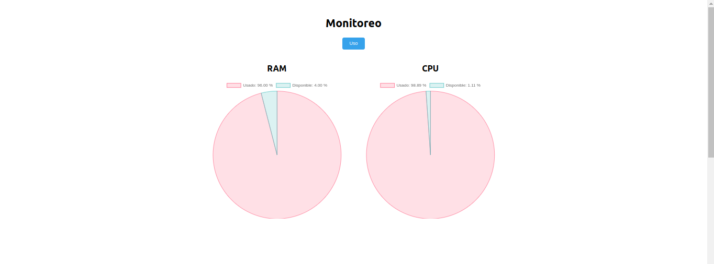
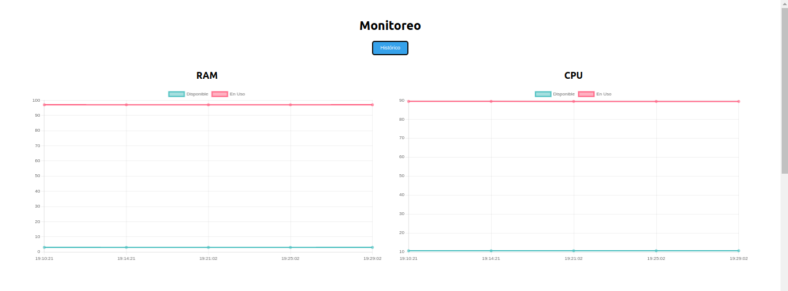
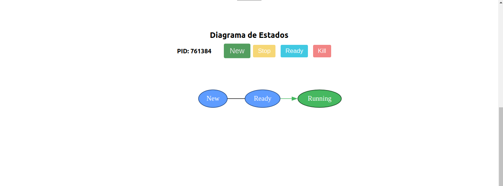
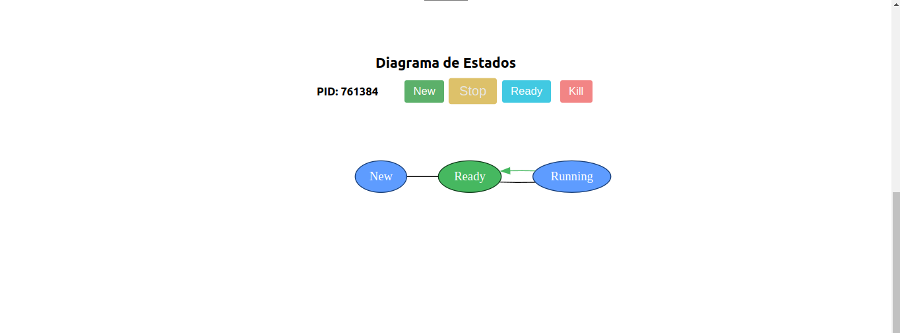
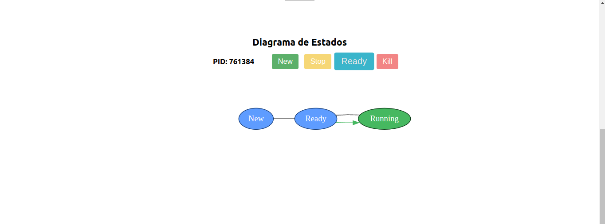

# Proyecto 1 SO1 1S 2024

## 201908355 - Danny Hugo Bryan Tejaxún Pichiyá

## Dashboard
### Monitoreo
Se muestra gráficamente el uso actual tanto de la RAM como del CPU.  
  

Se muestra gráficamente el historial de uso que ha tenido la RAM y el CPU.  
  

### Procesos
Se muestra gráficamente un proceso en específico el cual se selecciona mediante su PID mediante un select. Para cada proceso se muestran sus procesos hijos.  
  

### Simulación De Cambio De Estados En Los Procesos
* **New**: Se encarga de crear un nuevo proceso. El flujo de creación comienza desde que se crea, está en espera para ejecución y cuando está en ejecución.  
  

* **Stop**: Se encarga de detener la ejecución del proceso. Es decir pasa de estar en ejecución a estar en espera para ejecución.  
  

* **Ready**: Se encarga de continuar con la ejecución de un proceso detenido. Es decir pasa de estar en espera para ejecución a estar en ejecución.
  

* **Kill**: Se encarga de terminar un proceso. Es decir finaliza la ejecución de un proceso que no podrá ser reanudado.
  

## Base De Datos
```sql
CREATE TABLE IF NOT EXISTS RAM (
    id INT AUTO_INCREMENT PRIMARY KEY,
    usado FLOAT,
    disponible FLOAT,
    tiempo DATETIME
);

CREATE TABLE IF NOT EXISTS CPU (
    id INT AUTO_INCREMENT PRIMARY KEY,
    usado FLOAT,
    disponible FLOAT,
    tiempo DATETIME
);
```

## Módulos De Kernel
Se utilizaron las siguiente librerías de C para crear módulos de Kernel para Linux.  
```<linux/mm.h>```  
```<linux/sched.h>```  
```<linux/sched/signal.h>```  

## API
### Peticion  
Recibe el cuerpo de la petición al momento de insertar nuevos datos de uso de RAM y CPU a la base de datos.
```go
type Reg struct {
	UsadoRAM      float64 `json:"usadoram"`
	DisponibleRAM float64 `json:"disponibleram"`
	UsadoCPU      float64 `json:"usadocpu"`
	DisponibleCPU float64 `json:"disponiblecpu"`
}
```
### Grafo  
Almacena la información requerida para poder simular el cambio de estados de los procesos.
```go
type Graph struct {
	Transitions       fiber.Map
	ThereIsAnyProcess bool
	CurrentPID        int
}
```

* **Transiciones**  
    Almacena la estructura básica del grafo. Se manipula el mapa clave-valor para simular los estados cambiantes. Las claves principales contienen los nombres de los estados. La clave "status" de cada estado indica si la simulación está en dicho estado como actual. La clave "to" almacena un slice que contiene los estados a los que ya fue el estado actual.
    ```go
    Transitions := fiber.Map{
		"new": fiber.Map{
			"status": "Nothing",
			"to":     []string{"ready"},
		},
		"ready": fiber.Map{
			"status": "Nothing",
			"to":     []string{"running"},
		},
		"running": fiber.Map{
			"status": "Current",
			"to":     []string{},
		},
		"terminated": fiber.Map{
			"status": "Nothing",
			"to":     []string{},
		},
	}
    ```

### Controlador  
Se encarga de guardar la instancia de la base de datos de MySQL y la manipulación y obtención de información.
```go
type Controller struct {
	DB    *sql.DB
	err   error
	Graph *Graph
}
```