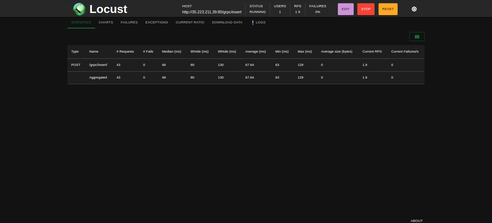
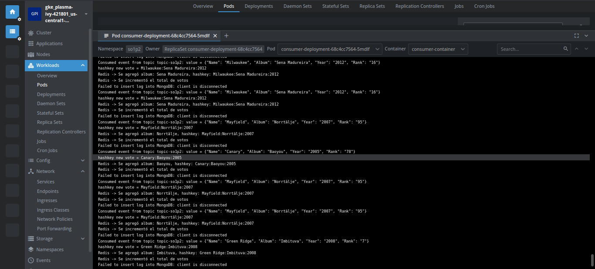
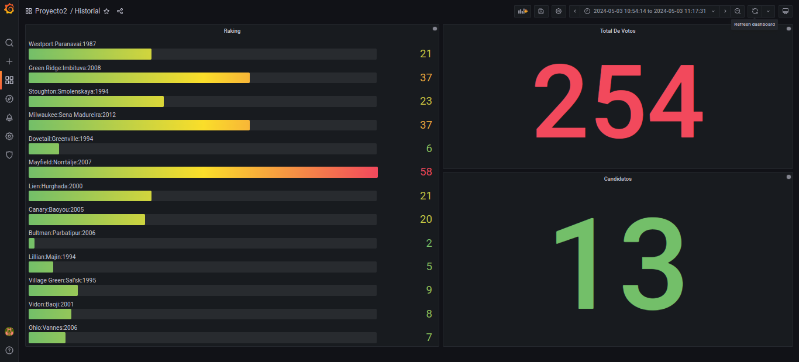

# Proyecto 2 SO1 1S 2024

## 201908355 - Danny Hugo Bryan Tejaxún Pichiyá

## Sistema Distribuido de Votaciones

## Introducción
El Sistema Distribuido de Votaciones es un proyecto que busca implementar un sistema de votación para un concurso de bandas de música guatemalteca utilizando tecnologías modernas como microservicios en Kubernetes, sistemas de mensajería como Kafka, bases de datos como Redis y MongoDB, y herramientas de visualización como Grafana. Este documento detalla los objetivos del proyecto, describe las tecnologías utilizadas, explica la arquitectura del sistema, muestra ejemplos de su funcionamiento y presenta conclusiones sobre el desarrollo.

## Objetivos
Implementar un sistema distribuido con microservicios en Kubernetes.
Utilizar sistemas de mensajería para encolar distintos servicios.
Utilizar Grafana como interfaz gráfica de dashboards.

## Tecnologías Utilizadas
* **Python**: Para desarrollar el generador de tráfico Locust.  
* **Golang**: Para implementar el servidor y cliente productor de gRPC, así como el daemon consumidor.  
* **Rust**: Para desarrollar el servidor productor de Rust.  
* **Docker**: Para construir contenedores de bases de datos Redis y MongoDB.  
* **Kubernetes (K8s)**: Para orquestar y gestionar los contenedores en un clúster.  
* **Google Cloud Platform (GCP)**: Para desplegar el clúster de Kubernetes.  
* **Kafka**: Como sistema de mensajería para encolar datos entre productores y consumidores.  
* **Strimzi**: Para instalar y gestionar el servidor Kafka en Kubernetes.  
* **Redis**: Como base de datos para almacenar contadores en tiempo real.  
* **MongoDB**: Como base de datos para guardar logs.  
* **Grafana**: Como herramienta de visualización para crear dashboards con datos de Redis.  
* **Node.js y Vue.js**: Para desarrollar la API y la webapp para consultar los logs de MongoDB.  
* **Cloud Run**: Para desplegar la API y la webapp en servicios de Google Cloud.  

## Deployments Y K8S
* **gRPC y Rust**: Pod con servidores productores de gRPC y Rust.  
* **Kafka**: Un servicio para el servidor de Kafka.  
* **Consumidor**: Un pod con el daemon consumidor escrito en Golang.  
* **Redis y MongoDB**: Pods con bases de datos Redis y MongoDB respectivamente.  
* **Grafana**: Un servicio para conectar Grafana a Redis.  
* **Cloud Run**: Pods con la API y la webapp desplegadas en servicios de Cloud Run.  

## Funcionamiento
El funcionamiento del sistema se ilustra a través de capturas de pantalla que muestran la generación de tráfico con Locust, el flujo de datos entre productores y consumidores a través de Kafka, la visualización de contadores en tiempo real en Grafana, y la consulta de logs en la webapp desplegada en Cloud Run.

Figura 1: Locust generando tráfico de votaciones.  
  

Figura 2: Consumidor obteniendo datos de kafka y enviarlos a bases de datos en Redis y Mongo.  
  

Figura 3: Grafana visualizando contadores de votaciones en tiempo real.  
  

Figura 4: Webapp consultando logs de MongoDB.  
  

## Conclusiones
La implementación de los microservicios en Kubernetes facilita la escalabilidad y la gestión del sistema distribuido.
La utilización de sistemas de mensajería como Kafka permite una comunicación eficiente entre los distintos componentes del sistema.
Grafana proporciona una interfaz intuitiva y poderosa para visualizar datos en tiempo real.
Cloud Run ofrece una plataforma ágil y fácil de usar para desplegar aplicaciones web y APIs.
El proyecto demuestra la viabilidad y eficacia de utilizar tecnologías modernas para construir sistemas distribuidos escalables y robustos.