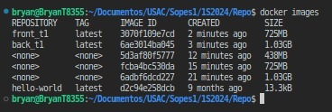
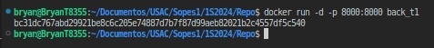

# Tarea 1

[Video Explicativo](https://www.youtube.com/watch?v=ZWAJQCKuhoE)

### Construcción de Contenedores  

### Verificación de Imágenes Creadas  

### Ejecución de Contenedores  

### Verificación de Contenedores en Ejecución  
