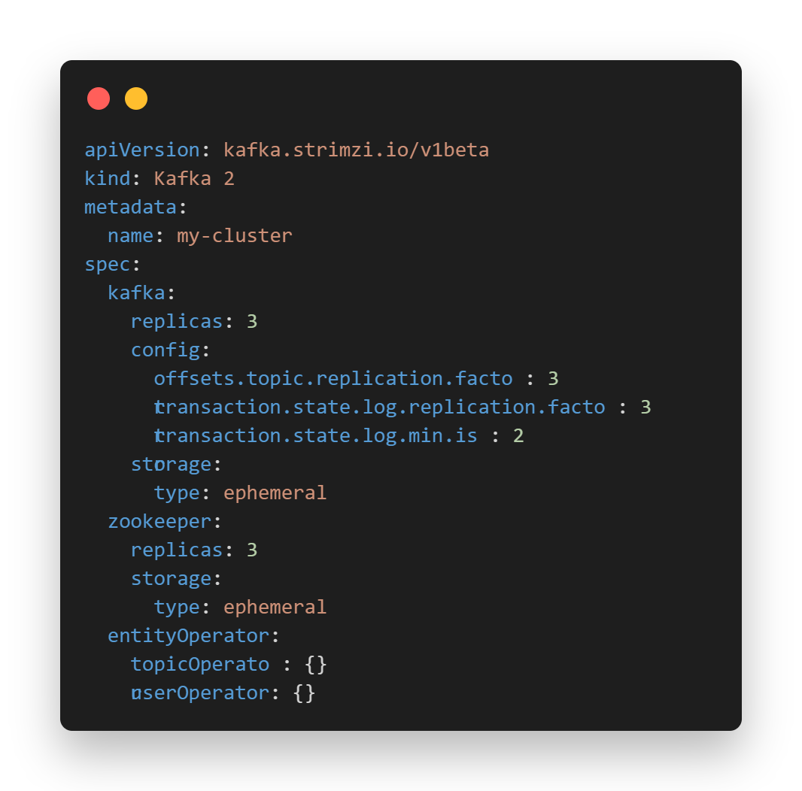
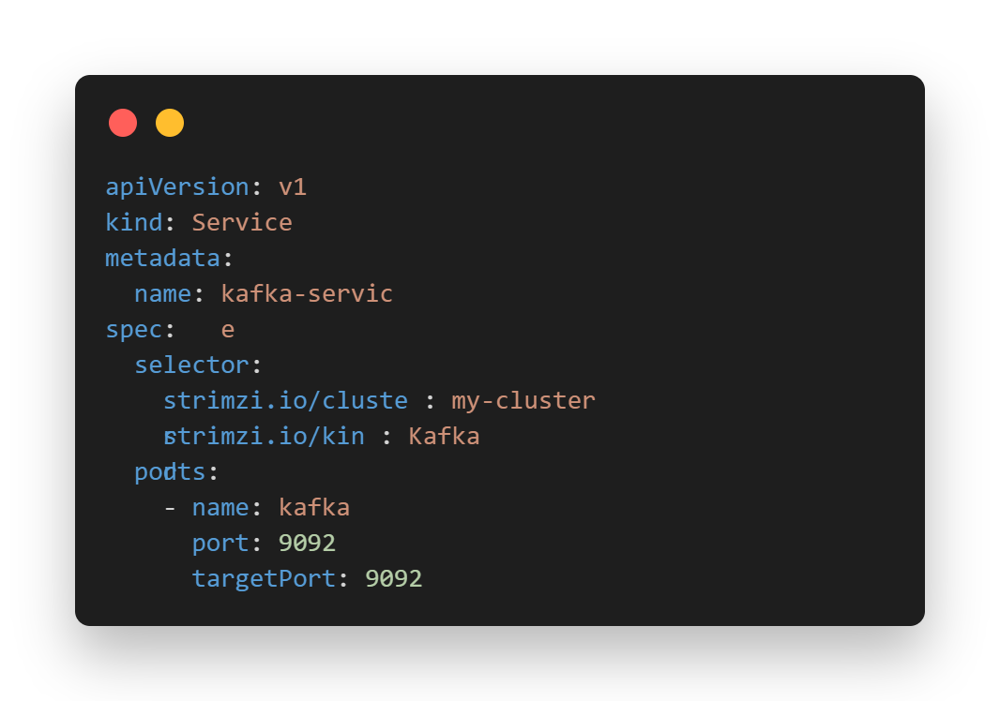
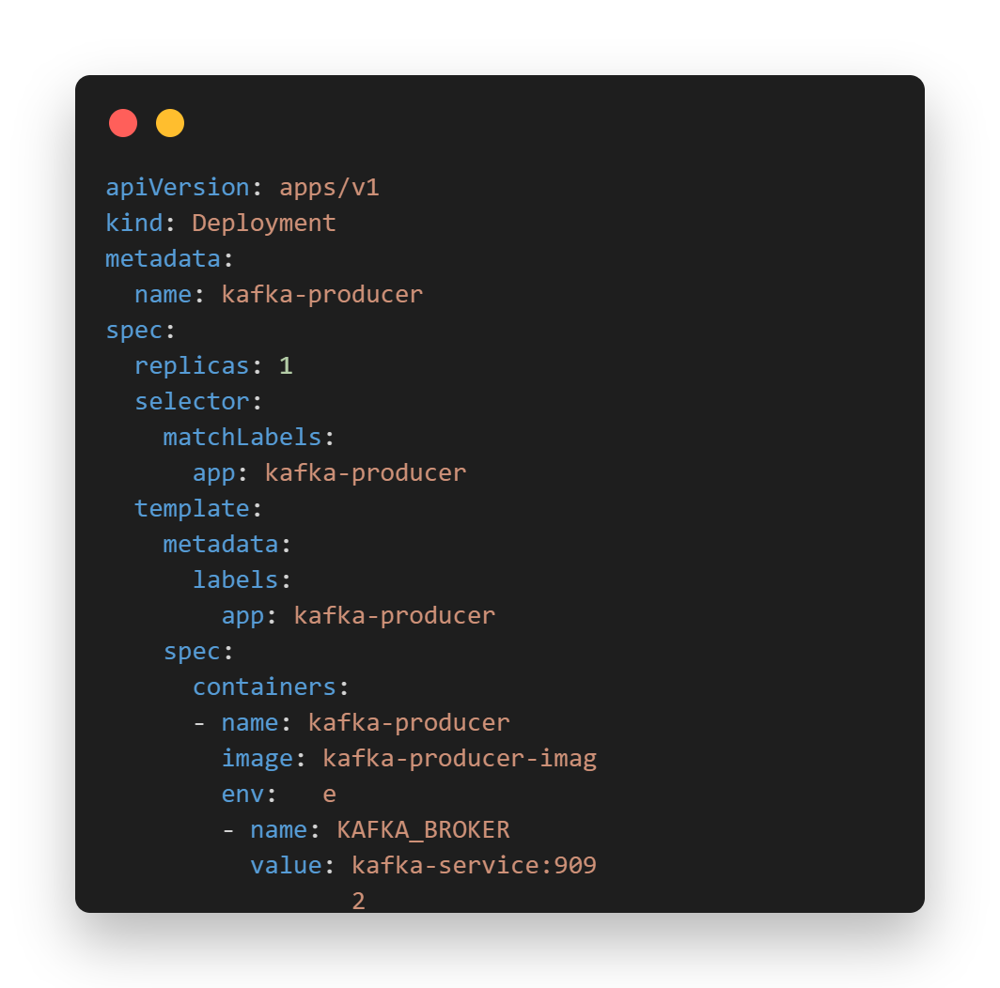

# Kubernetes: Tipos De Servicios Y La Integración De Kafka Con Strimzi

## Introducción
Kubernetes ha revolucionado la forma en que desplegamos, gestionamos y escalamos aplicaciones en entornos de contenedores. Entre sus múltiples características, los servicios son fundamentales para garantizar la conectividad y el enrutamiento de los recursos dentro del clúster. Por otro lado, Kafka, una plataforma de streaming de eventos, es ampliamente utilizada para el procesamiento de datos en tiempo real.

## Tipos de Servicios en Kubernetes
Kubernetes ofrece varios tipos de servicios para exponer aplicaciones dentro de un clúster y permitir la comunicación entre ellas:
* **ClusterIP**: Este es el tipo de servicio predeterminado. Expone el servicio en una dirección IP interna dentro del clúster, permitiendo la comunicación entre pods.
* **NodePort**: Expone el servicio en un puerto estático en cada nodo del clúster. Esto permite el acceso externo al servicio a través de la dirección IP del nodo y el puerto especificado.
* **LoadBalancer**: Este tipo de servicio asigna un balanceador de carga externo a una dirección IP específica. Es útil para distribuir la carga entre varios nodos y proporcionar acceso externo a los servicios.
* **ExternalName**: Proporciona un nombre DNS para un servicio externo, permitiendo a las aplicaciones dentro del clúster acceder a servicios externos como si estuvieran dentro del clúster.

## Integración de Kafka con Strimzi en Kubernetes
Kafka es una solución robusta para el procesamiento de datos en tiempo real. Strimzi es un operador de Kubernetes que facilita la administración y operación de Kafka en entornos de contenedor.

* **Instalación de Strimzi**: Instalar el operador de Strimzi en el clúster de Kubernetes. El operador se encargará de gestionar los recursos de Kafka, como los brokers, topics y usuarios.

* **Creación de un Servicio para Kafka**: Una vez que Kafka está desplegado con Strimzi, es posible crear un servicio para exponer el broker de Kafka dentro del clúster.

* **Integración con Aplicaciones**: Con el servicio de Kafka en funcionamiento, las aplicaciones dentro del clúster pueden conectarse al broker de Kafka utilizando el nombre del servicio y el puerto especificado.

### Asistencia
* 201908355 Danny Hugo Bryan Tejaxún Pichiyá
